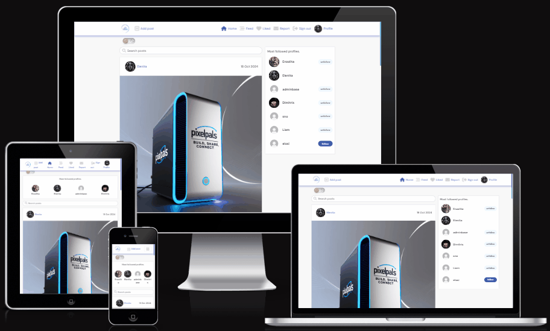

# Pixelpals API

 
 
Pixelpals is a Full-Stack web application that empowers users to share engaging content, drawing inspiration from popular social media platforms like Instagram. Leveraging Django Rest Framework for robust backend operations and React for a responsive frontend, Pixelpals delivers a smooth, intuitive experience for users to browse, create, and interact with captivating content.
 
 
The Pixelpals API serves as the backend service for the Pixelpals Application, [view live site here](https://pixelpals-pp5-ee2d5ecf265c.herokuapp.com/).

## Table of Contents
- [Pixelpals API](#pixelpals-api)
  - [General Details](#general-details)
  - [Database and model](#database-and-model)
  - [Technologies](#technologies)
  - [Testing and Issues](#testing-and-issues)
  - [Deployment](#deployment)
  - [Credits](#Credits)

## General Details

This is the API for the Pixelpals backend application. Detailed information about strategy, structure, skeleton, surface plane, testing and open issues is found in the frontend repository README and TESTING information.

- The Pixelpals [frontend repository](https://github.com/Enzolita/pixelpals-pp5)
- The Pixelpals [backend repository](https://pixelpals-backend-49bb71efec81.herokuapp.com/)                                    

## Database and Model

In the development environment, Pixelpals uses SQLite, which is simple to set up and ideal for development and testing. For the production environment, PostgreSQL is used due to its robustness, scalability, and advanced features suitable for handling a live web application.

Models in Pixelpals

 

### Report model
- **Fields**: Manages user feedback and queries. 
- **Functionality**: Stores user queries, complaints, or suggestions. 
- **Impact**: Provides a direct channel for user feedback, helping to improve the platform based on user input and enhancing user satisfaction.
- **Example**: A user facing an issue with their account can easily send a message to the support team using the report form, ensuring their query is logged and addressed promptly.

### Comment Model
- **Fields**: `id`, `owner`, `post_`, `content`, `created_at`, `updated_at`
- **Functionality**: Stores comments made by users on posts.
- **Impact**: Facilitates engagement and community interaction by allowing users to comment on each other's posts.
- **Example**: Users comment on a friend's post to share their thoughts and reactions, fostering discussions.

### Post Model
- **Fields**: `id`, `owner`, `title`, `content`, `created_at`, `updated_at`
- **Functionality**: Stores posts created by users.
- **Impact**: Central to the content-sharing functionality, allowing users to create and share posts with their followers.
- **Example**: A user creates a new post with a photo from their new PC setup.

### Profile Model
- **Fields**: `id`, `owner`, `name`, `content`, `image`, `created_at`, `updated_at`
- **Functionality**: Stores user profile information.
- **Impact**: Enhances user profiles by allowing customization, making the platform more personalized and engaging.
- **Example**: A user uploads a profile picture and writes a short bio to let other users know more about them.

### Follower Model
- **Fields**: `id`, `owner`, `followed`, `created_at`, `updated_at`
- **Functionality**: Stores follower relationships between users.
- **Impact**: Enables users to follow each other, creating a personalized feed based on followed users' posts.
- **Example**: User A follows User B to see User B's posts in their feed, fostering engagement and community building.

### Like Model
- **Fields**: `id`, `owner`, `post`, `created_at`, `updated_at`
- **Functionality**: Stores likes on posts by users.
- **Impact**: Provides a way for users to express appreciation for content, increasing user interaction and engagement.
- **Example**: A user likes a friend's post, which may also increase the visibility of popular content through likes.

### User Model (from django.contrib.auth.models)
- **Fields**: `id`, `username`, `email`, `password`, `created_at`, `updated_at`
- **Functionality**: Manages user authentication and basic information.
- **Impact**: Provides essential authentication functionality, ensuring users can securely log in and access their accounts.
- **Example**: Users can register, log in, and have their authentication details securely stored.

### Data Modeling and Database Design

Entity-Relationship Diagram

 

The Entity-Relationship Diagram (ERD) provides a visual representation of the database's structure. It helps in planning and illustrating the SQL tables and the relationships between them. The ERD is an essential part of the database design that shows the entities, their attributes, and the types of relationships among the entities.

I used [dbdiagram.io](https://dbdiagram.io/home) to make the ERD for this project.

**Relationships**

1. **User**
   - One-to-Many: User.id → Post.user_id
   - One-to-Many: User.id → Comment.user_id
   - One-to-Many: User.id → Like.user_id
   - One-to-Many: User.id → Report.report_id
   - Many-to-Many (through Followers): User.id → Followers.follower_id
   - Many-to-Many (through Followers): User.id → Followers.followed_id

2. **Post**
   - Many-to-One: Post.user_id → User.id
   - One-to-Many: Post.id → Comment.post_id
   - One-to-Many: Post.id → Like.post_id
   - One-to-Many: Post.id → Report.post_id

3. **Comment**
   - Many-to-One: Comment.user_id → User.id
   - Many-to-One: Comment.post_id → Post.id

4. **Like**
   - Many-to-One: Like.user_id → User.id
   - Many-to-One: Like.post_id → Post.id

5. **Followers**
   - Many-to-One: Followers.follower_id → User.id
   - Many-to-One: Followers.followed_id → User.id

6. **Report**
   - Many-to-One: Report.report_id → User.id
   - Many-to-One: Report.post_id → Post.id

7. **Tickets**
   - Many-to-One: Tickets.report_id → Reports.id

8. **Reports**
   - One-to-Many: Report.id → Tickets.report_id

*[Back to Content](#table-of-contents)*

## Technologies

Language

 

- [Python](https://www.python.org/) serves as the back-end programming language.

 

Frameworks, libraries and dependencies used in the backend part of the project.

 

- [asgiref==3.8.1](https://pypi.org/project/asgiref/) ASGI is a standard for Python asynchronous web apps and servers to communicate with each other, and positioned as an asynchronous successor to WSGI.
- [cloudinary==1.41.0](https://pypi.org/project/cloudinary/) allows you to quickly and easily integrate your application with Cloudinary.
- [dj-database-url==0.5.0](https://pypi.org/project/dj-database-url/0.5.0/) This simple Django utility allows you to utilize the 12factor inspired DATABASE_URL environment variable to configure your Django application.
- [dj-rest-auth==2.1.9](https://dj-rest-auth.readthedocs.io/en/2.1.9/) a set of REST API endpoints to handle User Registration and Authentication tasks.
- [Django==4.2](https://docs.djangoproject.com/en/4.2/) Django is a high-level Python web framework that encourages rapid development and clean, pragmatic design.
- [django-allauth==0.50.0](https://docs.allauth.org/en/latest/) Integrated set of Django applications addressing authentication, registration, account management as well as 3rd party (social) account authentication.
- [django-cloudinary-storage==0.3.0](https://pypi.org/project/django-cloudinary-storage/0.3.0/) Django Cloudinary Storage is a Django package that facilitates integration with Cloudinary by implementing Django Storage API.
- [django-cors-headers==4.4.0](https://pypi.org/project/django-cors-headers/) is a Django application for handling the server headers required for Cross-Origin Resource Sharing (CORS).
- [django-filter==2.4.3](https://pypi.org/project/django-filter/2.4.0/) django-filter is a reusable Django application for allowing users to filter querysets dynamically.
- [djangorestframework==3.15.2](https://pypi.org/project/djangorestframework/) is a powerful and flexible toolkit for building Web APIs.
- [djangorestframework-simplejwt==5.3.1](https://pypi.org/project/djangorestframework-simplejwt/) A minimal JSON Web Token authentication plugin for Django REST Framework.
- [gunicorn==23.0.0](https://pypi.org/project/gunicorn/) is a Python WSGI HTTP Server for UNIX.
- [oauthlib==3.2.2](https://pypi.org/project/oauthlib/3.2.2/) is a generic, spec-compliant, thorough implementation of the OAuth request-signing logic.
- [Pillow==10.4.0](https://pypi.org/project/pillow/10.4.0/) The Python Imaging Library enhances your Python interpreter with extensive file format support, efficient data representation, and powerful image processing capabilities.
- [psycopg2==2.9.9](https://pypi.org/project/psycopg2/) PostgreSQL database adapter for the Python programming language. The stand-alone binary package was chosen due to the normal psycopg2 throwing errors.
- [PyJWT==2.9.0](https://pypi.org/project/PyJWT/2.9.0/) JSON Web Token implementation in Python.
- [python3-openid==3.2.0](https://pypi.org/project/python3-openid/) OpenID support for modern servers and consumers.
- [pytz==2024.2](https://pypi.org/project/pytz/2024.2/) allows accurate and cross platform timezone calculations.
- [requests-oauthlib==2.0.0](https://pypi.org/project/requests-oauthlib/2.0.0/) provides first-class OAuth library support for Requests.
- [setuptools==68.0.0](https://pypi.org/project/setuptools/68.0.0/) is a Python library that helps developers package and distribute Python projects. It provides tools to package Python code so it can be easily installed and used by others, either by sharing the package on the Python Package Index (PyPI) or installing it locally.
- [sqlparse==0.5.1](https://pypi.org/project/sqlparse/0.5.1/) sqlparse is a non-validating SQL parser for Python. It provides support for parsing, splitting and formatting SQL statements.

 

Tools and Services

 

- [Code Institute Python Linter](https://pep8ci.herokuapp.com/) a tool to check Python code against some of the style conventions in PEP8.
- [Code Institute Template](https://github.com/Code-Institute-Org/ci-full-template) provided me with a familiar base from which to build my project.
- [Diffchecker](https://www.diffchecker.com/text-compare/) is used to check code snippets.
- [Draw.io](https://www.drawio.com/) is useful for planning the application's architecture and flowcharts, especially helpful in the design phase to visualize the application flow.
- [Git](https://git-scm.com/) is used for version control.
- [Gitpod](https://gitpod.io/) streamlines your development process by providing a pre-configured, cloud-based development environment that's instantly ready for coding.
- [Github](https://github.com/) is essential for version control, allowing you to track changes, collaborate with others (if applicable), and secure online code storage.
- [Google Dev Tools](https://developers.google.com/web/tools) is used during testing, debugging and styling.
- [Heroku](https://www.heroku.com/) is a platform for deploying and hosting web applications.
- [Lucidchart](https://www.lucidchart.com/) is used for ERD (entity relationship diagram)
- [PEP8](https://peps.python.org/pep-0008/) a style guide for Python code.
- [PostgreSQL](https://dbs.ci-dbs.net/) provided by the Code Institute, is employed as the database system for its robustness and compatibility with Django.

 

*[Back to Content](#table-of-contents)*

## Testing and Issues

Information about how the project was tested & Issues encountered, please refer to the [pixelpals-frontend repository, TESTING.md](https://github.com/Enzolita/pixelpals-pp5/blob/main/TESTING.md)

*[Back to Content](#table-of-contents)*

## Deployment

Version Control

 
The site was created using the Gitpod editor and pushed to github to the remote repository ‘pixelpals-frontend’.
The following git commands were used throughout development to push code to the remote repo:

- `git add <file>` - This command was used to add the file(s) to the staging area before they are committed.
- `git commit -m “commit message”` - This command was used to commit changes to the local repository queue ready for the final step.
- `git push` - This command was used to push all committed code to the remote repository on github.

### Heroku

 

 
To deploy the project to Heroku, I took the following steps

  

Create a new workspace in your preferred IDE, in our case it was [Gitpod](https://www.gitpod.io/docs/introduction/getting-started), and set up the new drf-api project. Use [Django REST framwork](https://www.django-rest-framework.org/) guide. 

**Project Settings**

- Include https://<your_app_name>.herokuapp.com in the ALLOWED_HOSTS and CSRF_TRUSTED_ORIGINS lists inside the settings.py file.
- Make sure that the environment variables (DATABASE_URL, SECRET_KEY, and CLOUDINARY_URL) are correctly set to os.environ.get("<variable_name>")
- If making changes to static files or apps, make sure to run collectstatic or migrate as needed.
- Commit and push to the repository.

**Requirements**

- Create a plain file called Procfile without any file suffix, at the root level of the project.
  - Add to the Procfile and save.
    - `release: python manage.py makemigrations && python manage.py migrate`
    - `web: gunicorn drf_api.wsgi`
- In your IDE terminal, type pip3 freeze local > requirements.txt to create the requirements.
- (Optional) Create a runtime.txt and type python-3.11.9 (or whichever version you use)
- Commit and push these files to the project repository.

 **Deployment to Heroku**

- In your heroku account, select New and then Create New App.
- Give it a unique name related to your project, choose the correct region for where you are located.
- Create app
- Goto 'Settings' tab and the Config Vars. For Heroku to be able to process and render the project, you must define some environment variables:
  - Add DATABASE_URL variable and assign it a link to your database
  - Add SECRET_KEY variable and assign it a secret key of your choice
  - Add CLOUDINARY_URL variable and assign it a link to your Cloudinary
  - Add ALLOWED_HOST variable and assign it the url of the deployed heroku link
  - Add CLIENT_ORIGIN variable and assign it the url of your deployed frontend app
  - Add CLIENT_ORIGIN_DEV variable and assign it the url of your local development client

- Continue to the 'Deploy' tab. 
  - Select GitHub as the 'deployment method'.
  - Confirm connection to git hub by searching for the correct repository and then connecting to it.
  - To manually deploy project click 'Deploy Branch'. 
      - Don't forget to ensure Debug is false for final deployment
  - Once built a message will appear saying: Your app was successfully deployed. 
  - Click the view button to view the deployed page making a note of it's url.

### Github

How to Clone the Repository

 

Cloning a GitHub repository creates a local copy on your machine, allowing you to sync between the two locations. Here are the steps:
 

- Log in (or sign up) to GitHub.
- Navigate to the GitHub Repository you want to clone to use locally.
- Click on the code button
- Select whether you would like to clone with HTTPS, SSH or GitHub CLI and copy repository link to the clipboard.
- Open the terminal in your code editor of choice (git must be installed for the nextcoming steps)
- Change the current working directory to the location you want to use for the cloned directory.
- Type 'git clone' into the terminal and then paste the link you copied previously. Press enter.
- If you are working in VSCode, create a virtual environment with command: `python3 -m venv .venv` 
- Agree to select as workspace folder. 
- Move to the virtual environment with command: `source .venv/bin/activate`
- Import all dependencies with command: `pip3 install -r requirements.txt`
- Create an 'env.py' file in the main directory.
- Enter key data, such as: SECRET_KEY, CLIENT_ORIGIN_DEV, CLOUDINARY_URL, DATABASE_URL and ['DEV'] = '1'
- Check that both the virtual environment and env.py are named in the .gitignore file.
- Check it's all working by running the server, use command: `python3 manage.py runserver`
 

 

How to Fork the Repository

 

Most commonly, forks are used to either propose changes to someone else's project or to use someone else's project as a starting point for your own idea. In order to protect the main branch while you work on something new, essential when working as part of a team or when you want to experiment with a new feature, you will need to fork a branch.
 

- Log in (or sign up) to Github.
- Go to the selected repository.
- Click the Fork button in the top right corner and select create a fork.
- One can change the name of the fork and add description
- Choose to copy only the main branch or all branches to the new fork.
- Click Create a Fork. A repository should appear in your GitHub

## Credits

Content

 

Throughout the development of Pixelpals, a variety of resources have been utilized to ensure the platform is robust, user-friendly, and engaging. Below is a list of key documentation, blogs, tutorials, and guides that have been instrumental in crafting the backend functionality:

- **Bootstrap**: Extensively used for styling and responsive design, making the site accessible on a variety of devices - [Bootstrap documentation](https://getbootstrap.com/).
- **Django**: As the backbone of our platform, Django's comprehensive documentation has been crucial for backend development - [Django documentation](https://docs.djangoproject.com/en/4.2/).

- **Sources of inspiration and guidance in general**:
  - This resources is only available to enrolled students at The Code Institute:
    - The Code Institute Diploma in Full Stack Software Development (Advanced Front-End) Walk-through project Django REST framework (backend)
  - **Testing inspiration**: is listed in [Pixelpals-Frontend README](https://github.com/Enzolita/pixelpals-pp5/blob/main/README.md#content)

 

Acknowledgement

 

Please see the [frontend README](https://github.com/Enzolita/pixelpals-pp5/blob/main/README.md).

 

*[Back to Content](#table-of-contents)*    

[To frontend README](https://github.com/Enzolita/pixelpals-pp5/blob/main/README.md)